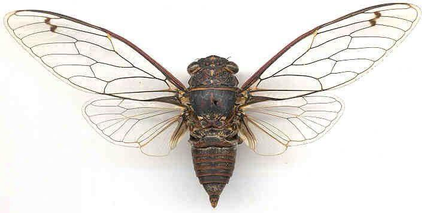

# An Eerie Invitation

Category: Steganography

## Description
Hello.  We are looking for supernatural individuals.  To find them, we have devised a mysterious test.



There is something strange hidden in this image.

Find it, and it will lead you on the spiritual journey to finding us.  We look forward to meeting the few ghosts, demons and djinns that will make it all the way through.

Good luck.

3110

## Solution

After analyzing the image with strings, binwalk, exiftool, steghide, stegsolve och stegdetect and a bunch of online tools I took a long pause continuing with other challenges. After looking at some similar write-ups online I found a couple of more tools to learn and try out - one of these were Outguess.

After using the tool with following commands, I got a Base64 encoded string which I decoded to obtain the flag O24{outguess_was_required_for_Cicada_3301}.

```
cb@ctf:~/ctf$ outguess -r cicada.jpg flag.txt
Reading cicada.jpg....
Extracting usable bits:  26032 bits
Steg retrieve: seed: 221, len:61
cb@ctf:~/ctf$ cat flag.txt
RmxhZzogb3V0Z3Vlc3Nfd2FzX3JlcXVpcmVkX2Zvcl9DaWNhZGFfMzMwMQ==
cb@ctf:~/ctf$ echo RmxhZzogb3V0Z3Vlc3Nfd2FzX3JlcXVpcmVkX2Zvcl9DaWNhZGFfMzMwMQ== | base64 --decode
Flag: outguess_was_required_for_Cicada_3301
```
